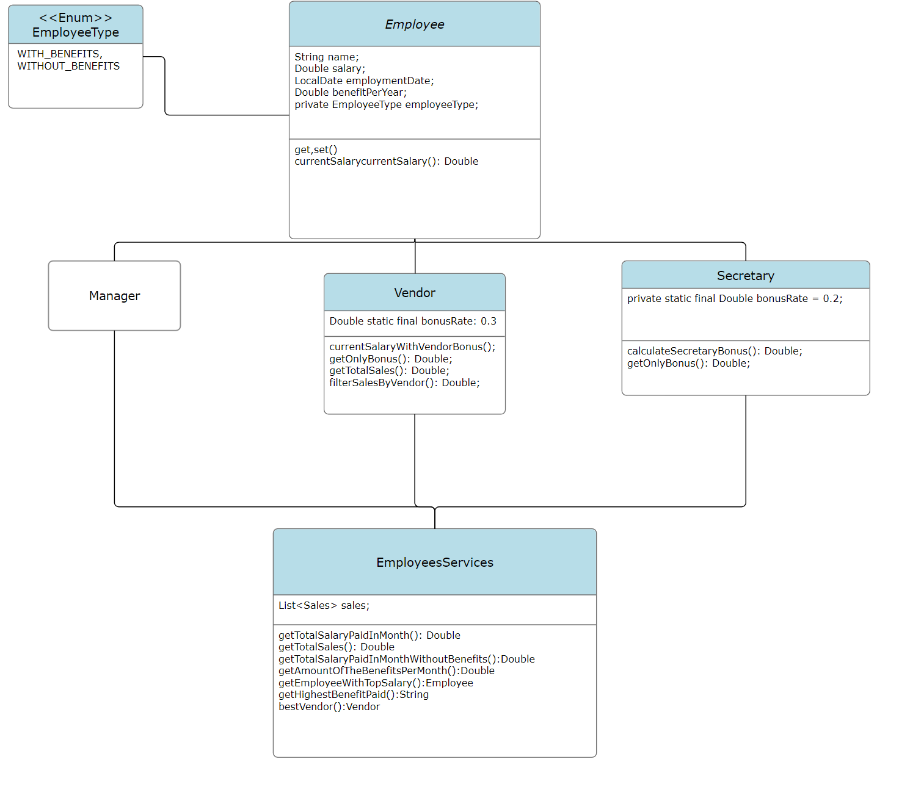

<a name="readme-top"></a>


[](https://www.linkedin.com/in/igor-alves-026397131/)

### Diagrama UML
<br />
<div align="center">
  
</div>


## Sobre o Projeto

Desáfio proposto pela empresa Sinerj com intuido de criar uma aplicação simples para calcular salarios baseado em mes e ano.

Neste Projeto Foi Proposto a ultização da linguagem java a qual foi ultilizada na sua versão 20.

foi ultilizado também Junit5 para a realização de testes unitários.


### Contruido com


## Obtendo o Projeto


### Pre requisitos

[Jdk versão 20 ](https://www.oracle.com/java/technologies/javase/jdk20-archive-downloads.html)


### Clone

   ```
1. git clone https://github.com/igorcalves/Desafio-Sinerji.git
   ```
  


<p align="right">(<a href="#readme-top">back to top</a>)</p>


<!-- CONTACT -->
## Contato

Email -  igor193@live.com

<p align="right">(<a href="#readme-top">back to top</a>)</p>


